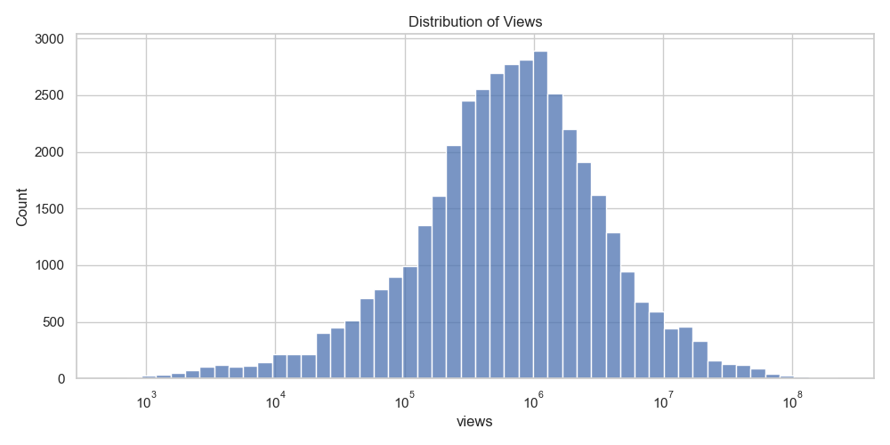

# YouTube Data Analysis


## Overview
This project cleans and processes a Kaggle dataset to then perform an **exploratory data analysis (EDA)** of some popular YouTube videos in the United States.  
Using Python and popular libraries such as Pandas, NumPy, Matplotlib, and Seaborn, we clean, preprocess, and visualise the dataset to extract meaningful information about video performance, trends, and user engagement.

In addition to this, we also develop a machine learning model to predict YouTube video likes based on the previously cleaned dataset using Scikit-Learn in Python.

The analysis includes:
- Analysis of views metrics
- Likes, dislikes, and comment ratios
- Trends over time
- Correlation between key metrics
- Metrics related to categories

---

## Dataset
The dataset used in this project is from Kaggle: [YouTube Trending Videos](https://www.kaggle.com/datasnaek/youtube-new).  

**Note:** The CSV files are **not included** in this repository due to size constraints. Please download the dataset manually and place it in the `data/` folder:

---

## Installation
To run this project locally, follow these steps:

1. Clone the repository:
```bash
git clone https://github.com/DiegoAladren/youtube-data-analysis.git
cd youtube-data-analysis
```

2. Create and activate a virtual environment:
```bash
python -m venv venv
# Windows
venv\Scripts\activate
# Mac/Linux
source venv/bin/activate
```

3. Install required packages:
```bash
Install required packages:
pip install -r requirements.txt
```

---

## Usage

### Data Cleaning

Run the 01_data_cleaning.ipynb notebook or src/data_preprocessing.py to:
- Remove duplicates and null values
- Convert date columns
- Map category IDs to category names
- Compute interaction ratios (like_ratio, comment_ratio)

This will generate a cleaned dataset.

### Exploratory Data Analysis

Run the 02_eda.ipynb notebook to explore:
- Views
- Interaction
- Dates and times

Visualizations include:
- Horizontal bar plots


- Histograms



- Correlation heatmaps


- Pie charts


- Scatter plots


- Line plots


### Basic Machine Learning

Run the 03_basic_machine_learning.ipynb notebook or src/ml_likes_prediction.py to:
- Load cleaned dataset
- Create features so that the model can be trained with relevant data
- Trains with that features a Random Forest regressor to predict video likes
- Comparing real values with the predictions to evaluate the model
- Save the model in a joblib file

## License

This project is for educational purposes. Please check the original dataset license on Kaggle.

## Contact

For questions or feedback, contact: diegoaladren854@gmail.com

LinkedIn: www.linkedin.com/in/diego-aladrén-mateo-7a6034307
